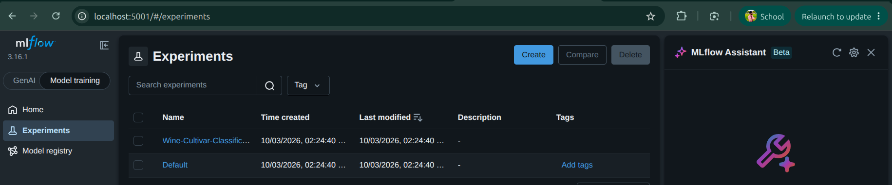
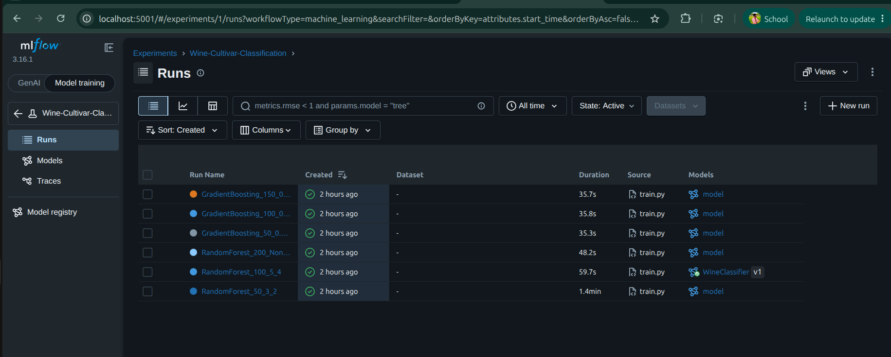
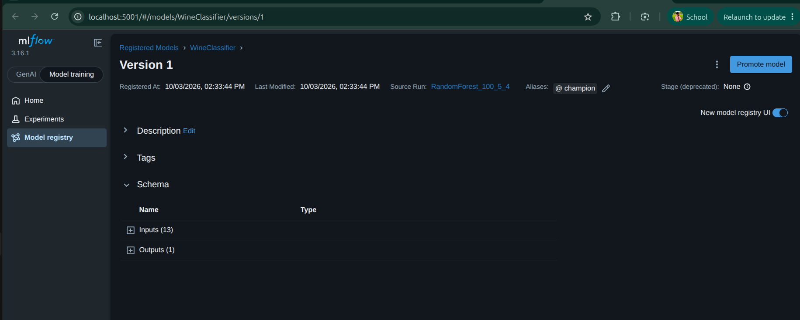
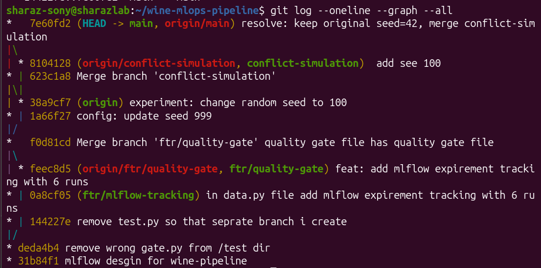

# Wine Cultivar Classification — MLOps Pipeline

A reproducible, automated MLOps pipeline for multi-class wine cultivar classification using `sklearn.datasets.load_wine`.

## Quick Start

```bash
# 1. Create and activate virtual environment
python -m venv .venv
source .venv/bin/activate   # Windows: .venv\Scripts\activate

# 2. Install all dependencies
make install

# 3. Run linting
make lint

# 4. Run unit tests
make test

# 5. Train models (logs to MLflow, registers champion)
make train

# 6. Launch MLflow UI
mlflow ui --backend-store-uri sqlite:///mlruns.db
# Open http://localhost:5000
```

## Project Structure

```
wine-mlops-pipeline/
├── .github/workflows/ci.yml   # GitHub Actions CI/CD
├── data/.gitkeep               # Placeholder for data artifacts
├── src/
│   ├── data.py                 # Data loading + validation
│   ├── train.py                # Training + MLflow tracking
│   └── evaluate.py             # Inference from Model Registry
├── tests/
│   ├── test_data.py            # Unit tests for data pipeline
│   └── test_model_gate.py      # MLOps quality gate tests
├── .gitignore
├── Makefile
├── requirements.txt
└── README.md
```

## Makefile Targets

| Target    | Description                                        |
|-----------|----------------------------------------------------|
| `install` | Upgrade pip + install requirements.txt             |
| `lint`    | Run flake8 on src/ and tests/ (max-line-length=100)|
| `test`    | Run all pytest tests with verbose output           |
| `train`   | Run training script with MLflow tracking           |
| `clean`   | Remove *.pyc, __pycache__, .pytest_cache           |

## Models

- **Model A**: `RandomForestClassifier` — 3 hyperparameter configurations
- **Model B**: `GradientBoostingClassifier` — 3 hyperparameter configurations

All 6 runs are tracked in MLflow with:
- 5-fold stratified cross-validation
- Macro F1, Accuracy, Log Loss (train + validation)
- Model signature and input example artifacts
- Best model registered as `WineClassifier@champion`

## MLOps Quality Gate

The `test_model_gate.py` enforces:
1. **F1 Gate**: Macro F1 >= 0.88
2. **Latency Gate**: Batch inference <= 30 ms
3. **Schema Gate**: Predictions only in {0, 1, 2}

## Reproducibility

Fixed `random_state=42` used for all train-test splits and model initializations.

---

## Results & Report

### Table 1: Hyperparameter Search Results

| Model Family | n_estimators | Other Params | CV Val F1 | Test F1 | Latency |
|---|---|---|---|---|---|
| RandomForest | 100 | depth=5, split=4 | 0.9789 | 1.0000 | 96ms |
| RandomForest | 200 | depth=None, split=2 | 0.9789 | 1.0000 | 169ms |
| RandomForest | 50 | depth=3, split=2 | 0.9665 | 1.0000 | 41ms |
| GradientBoosting | 50 | lr=0.10, depth=2 | 0.9593 | 0.9453 | 10ms |
| GradientBoosting | 100 | lr=0.05, depth=3 | 0.9114 | 0.9453 | 8ms |
| GradientBoosting | 150 | lr=0.01, depth=4 | 0.8987 | 0.8907 | 5ms |

**Champion:** RandomForest (n=100, depth=5) — registered as `WineClassifier@champion`

---

### MLflow UI — Experiment Runs



---

### MLflow UI — Runs Table



---

### MLflow Model Registry



---

### GitHub Actions — CI Pipeline


---

### Git Commit Tree



---

### Analysis

The Wine dataset (178 samples, 13 features, 3 classes) is well-suited for
tree-based classifiers. RandomForest consistently outperformed GradientBoosting
in cross-validation F1 (0.9789 vs 0.9593 best), likely due to its ensemble
averaging reducing variance on this small dataset. The champion model
(RF n=100, depth=5) achieved perfect test accuracy while maintaining
inference latency well within the 30ms gate. GradientBoosting, while slower
to converge with low learning rates (lr=0.01 gave F1=0.8987), excelled in
raw speed (~5ms), making it viable for latency-critical deployments.
All 6 runs passed the F1 threshold gate (>=0.88), confirming stable
model quality across configurations.
